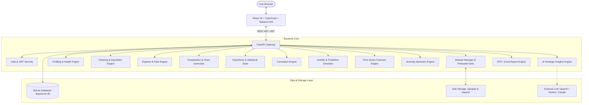

# System Architecture

## Architecture Overview
AI DataSense follows a layered, modular full-stack client-server architecture:

## Backend Modular Design
- **`backend/app/api/`**: Router definitions encapsulating endpoints per domain module (`auth`, `datasets`, `profiling`, `cleaning`, `explorer`, `visualization`, `statistics`, `correlation`, `ai_insights`, `ml`, `forecasting`, `anomaly`, `reports`).
- **`backend/app/services/`**: Pure business logic and computational data science services, keeping routers thin and decoupled.
- **`backend/app/models/`**: SQLAlchemy declarative models for persistence (`User`, `Dataset`, etc.).
- **`backend/app/schemas/`**: Pydantic v2 schemas defining input validation and response contracts.
- **`backend/app/core/`**: Central application configurations, JWT security tokens, database connection pool, and file paths.

## Frontend Modular Design
- **`frontend/src/pages/`**: 18 specialized views corresponding to each platform feature (Dashboard, Upload, Profiler, Cleaning, Explorer, Visualization, Statistics, Correlation, AI Insights, ML Studio, Forecasting, Anomaly, Reports, History, Settings, Auth).
- **`frontend/src/components/`**: Reusable UI components (Navbar, Sidebar, Metric Cards, Chart Containers, Modals).
- **`frontend/src/context/`**: Global application state (Auth context, Active Dataset selection, Theme).
- **`frontend/src/services/`**: Axios API client bindings and endpoint interfaces.
